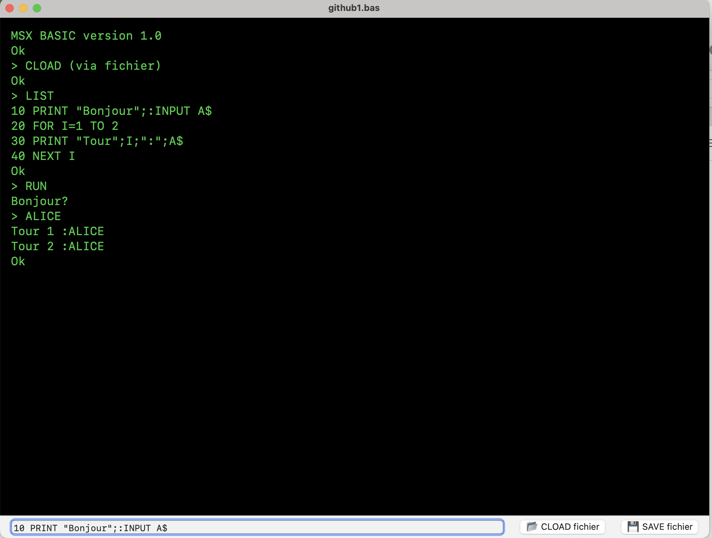
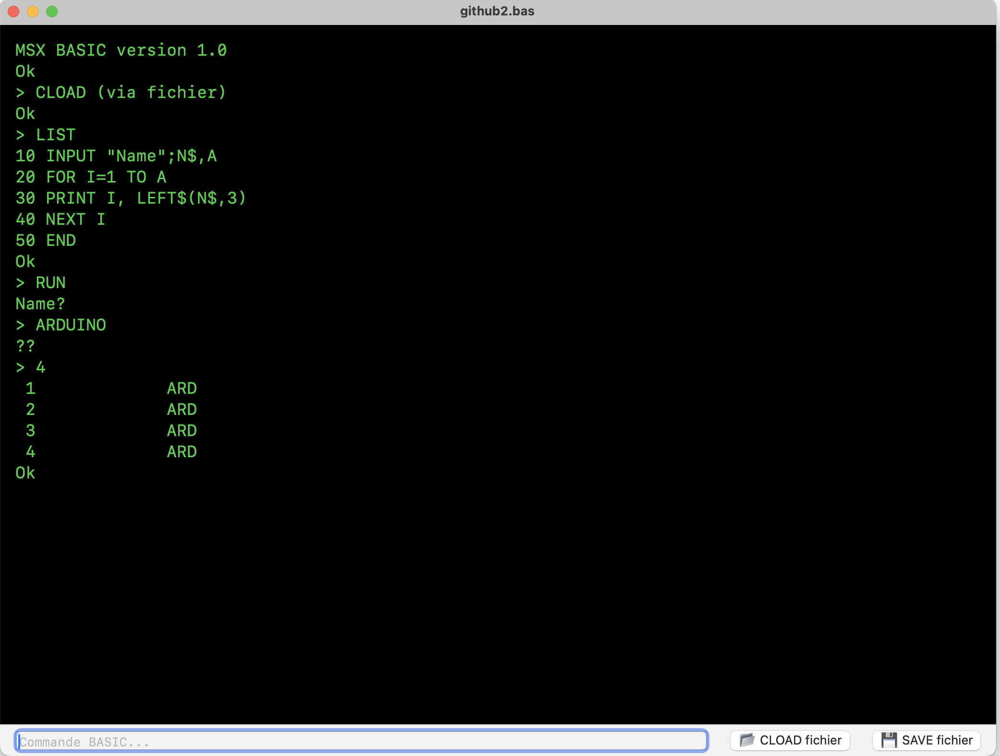

# MSXBasicSimulator


# MSXBasicSimulator

## Résumé

### Présentation
**MSXBasicSimulator** est un interpréteur **MSX BASIC 1.0** écrit en **Swift**.  
Ce projet a été conçu à but **pédagogique** et validé par plus de 150 tests.  

⚠️ Il ne vise **pas** à remplacer un véritable MSX :  
- pas de graphismes (`SCREEN`, `CIRCLE`, etc.),  
- pas de son (`SOUND`, `PLAY`),  
- pas de périphériques externes.  

### Mode commande directe
Toute instruction tapée sans numéro de ligne est **exécutée immédiatement**.

Exemple :
```basic
PRINT 2+3
```
Résultat :
```
 5
Ok
```

### Mode programme
Les lignes avec numéro sont stockées dans `BasicProgram.lines`.  
Exécution avec `RUN`.

Exemple :
```basic
10 PRINT "Bonjour";:INPUT A$
20 FOR I=1 TO 2
30 PRINT "Tour";I;":";A$
40 NEXT I
```
Exécution :
```
Bonjour?ALICE
Tour 1:ALICE
Tour 2:ALICE
Ok
```

### Instructions supportées

#### Contrôle de flux
- `IF ... THEN ... [ELSE ...]`
- `GOTO`, `GOSUB`, `RETURN`
- `FOR ... TO ... STEP ... NEXT`
- `ON expr GOTO ...` / `ON expr GOSUB ...`
- `END`
- `REM` et `'`

#### Entrée/Sortie
- `PRINT`, `?` (alias)
- `INPUT`
- `CLS`

#### Données / Mémoire
- `DIM`
- `DATA`, `READ`, `RESTORE`
- `CLEAR`, `NEW`, `LIST`, `RUN`
- Variables numériques et chaînes (`$`)

#### Fonctions chaînes
- `LEFT$`, `RIGHT$`, `MID$`, `LEN`, `CHR$`, `STR$`
- `HEX$`, `BIN$`, `OCT$`, `SPACE$`, `STRING$`

#### Fonctions numériques
- `VAL`, `ASC`, `INSTR`
- `ABS`, `SGN`, `INT`, `FIX`, `SQR`, `RND`, `SIN`, `COS`, `TAN`, `EXP`, `LOG`, `ATN`
- Opérateurs : `+ - * / MOD % ^` et comparaisons `= <> <= >= < >`
- Opérateurs logiques 16-bit : `NOT`, `AND`, `OR`, `XOR`, `EQV`, `IMP`

#### Fonctions utilisateur
- `DEF FNx(...)` (numérique)
- `DEF FNx$(...)` (chaîne)

### Différences avec MSX BASIC 1.0
- Tous les nombres sont représentés en `Double` (pas de `SINGLE`/`INTEGER`).  
- `PRINT` : zones de 14 colonnes, espace de signe pour positifs.  
- `CLEAR` : autorise un re-`DIM` unique après exécution.  
- `CLOAD`/`SAVE` : sauvegarde fichiers `.bas` dans le système local.  
- `SAVEF`/`LOADF` : snapshot JSON de l’environnement.  

---

## Annexe technique (fonctionnement interne détaillé)

### 1. Entrée d’une instruction
- L’UI affiche une console (`ConsoleView`) avec :
  - un `Text(output)` pour la sortie,
  - un champ de saisie `HistoryTextField` (gestion ↑/↓, Enter),
  - un historique (`CommandHistory`) sauvegardé dans `UserDefaults`.
- À la validation, `interpreter.execute(command:)` traite la ligne :
  - insertion dans le programme (si numérotée),
  - exécution immédiate sinon.

### 2. Immédiat vs programme
- **Immédiat** : chaque ligne est analysée et exécutée par `interpretImmediate`.
- **Programme (RUN)** :
  - `clearAllUserState("RUN start")`
  - reconstruction du `DATA pool`
  - exécution ligne par ligne, découpage sur `:` sauf pour `IF` et `REM`
  - gestion des signaux internes : `__WAIT_INPUT__`, `__GOTO__`, `__GOSUB__`, `__END__`, etc.

### 3. Exemple disséqué
Programme :
```basic
10 INPUT "Name";N$,A
20 FOR I=1 TO A
30 PRINT I, LEFT$(N$,3)
40 NEXT I
50 END
```
- Ligne 10 → `INPUT` : suspend le programme avec prompt.
- L’utilisateur tape `"John",3` → affectation `N$="John"`, `A=3`.
- Ligne 20 → `FOR` initialise la boucle.
- Ligne 30 → `PRINT` produit `1 Joh`, `2 Joh`, `3 Joh`.
- Ligne 40 → `NEXT` boucle.
- Ligne 50 → `END` → `Ok`.

### 4. Gestion DATA/READ
- `DATA` préchargés au `RUN start`.
- `READ` avance un pointeur interne.
- `RESTORE` remet ce pointeur au début ou à une ligne donnée.

### 5. Gestion d’état et erreurs
- `clearAllUserState` réinitialise variables, tableaux, DEF FN, piles de contrôle, et `TIME`.
- Erreurs : `Syntax error`, `Type mismatch`, `Division by zero`, `Out of data`, `NEXT without FOR`, `RETURN without GOSUB`, etc.
- `INPUT` affiche `Redo from start` en cas d’erreur de saisie.

### 6. Architecture des sources
- `BasicProgram.swift` → gestion du programme (lignes numérotées, LIST, NEW).
- `BasicInterpreter.swift` → moteur d’exécution et parsing.
- `CommandHistory.swift` → historique avec persistance.
- `ConsoleActions.swift` → commandes de menu (RUN, LIST, CLS, NEW, CLEAR_HISTORY).
- `ContentView.swift` → interface console et interaction utilisateur.
- `MSXBasicSimulatorApp.swift` → point d’entrée SwiftUI.
- `ouvrirFichierBAS.swift` / `sauvegarderFichierBAS.swift` → I/O fichiers BASIC.

### 7. Limitations connues
- Pas de `STOP` (qui sur MSX permettait BREAK + reprise CONT).
- Pas de graphismes ni de son.

---

## Captures d’écran

### Exemple 1 : Bonjour / Alice


### Exemple 2 : Arduino



## Licence
Projet ouvert à des fins pédagogiques.  
Élaboré avec l’assistance de **ChatGPT (OpenAI)**.

